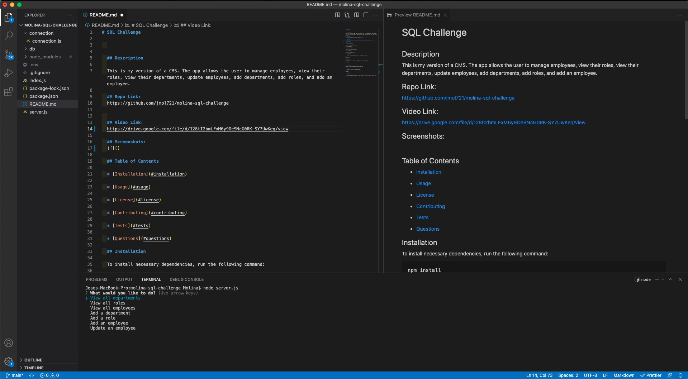
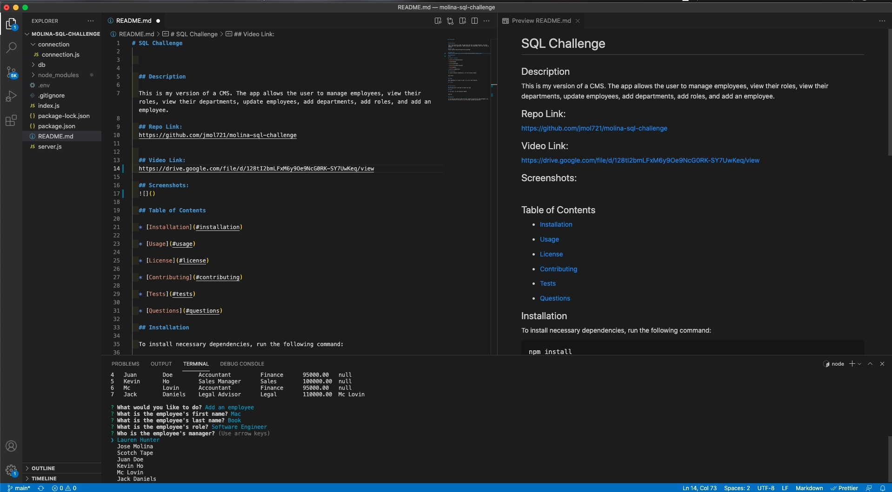
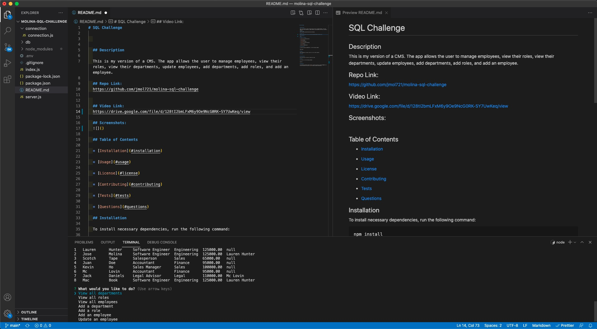

# SQL Challenge

  

  ## Description
  
  This is my version of a CMS. The app allows the user to manage employees, view their roles, view their departments, update employees, add departments, add roles, and add an employee.

  ## Repo Link:
  https://github.com/jmol721/molina-sql-challenge

  
  ## Video Link:
  https://drive.google.com/file/d/128tI2bmLFxM6y9Oe9NcG0RK-SY7UwKeq/view

  ## Screenshots:
  

  

  

  

  ## Table of Contents

  * [Installation](#installation)

  * [Usage](#usage)

  * [License](#license)

  * [Contributing](#contributing)

  * [Tests](#tests)

  * [Questions](#questions)

  ## Installation

  To install necessary dependencies, run the following command:

  ```
  npm install
  ```
  
  ## Usage

  What dependecies to install to get it to run on their machines.

  ## License

  

  ## Contributing

  How the app works to be able to improve the code.

  ## Tests

  No tests have been defined as of yet.

  ## Questions

  If you have any questions about the repo, contact me directly at jmolina721@gmail.com. You can find more of my work at [jmol721](https://github.com/jmol721/).
